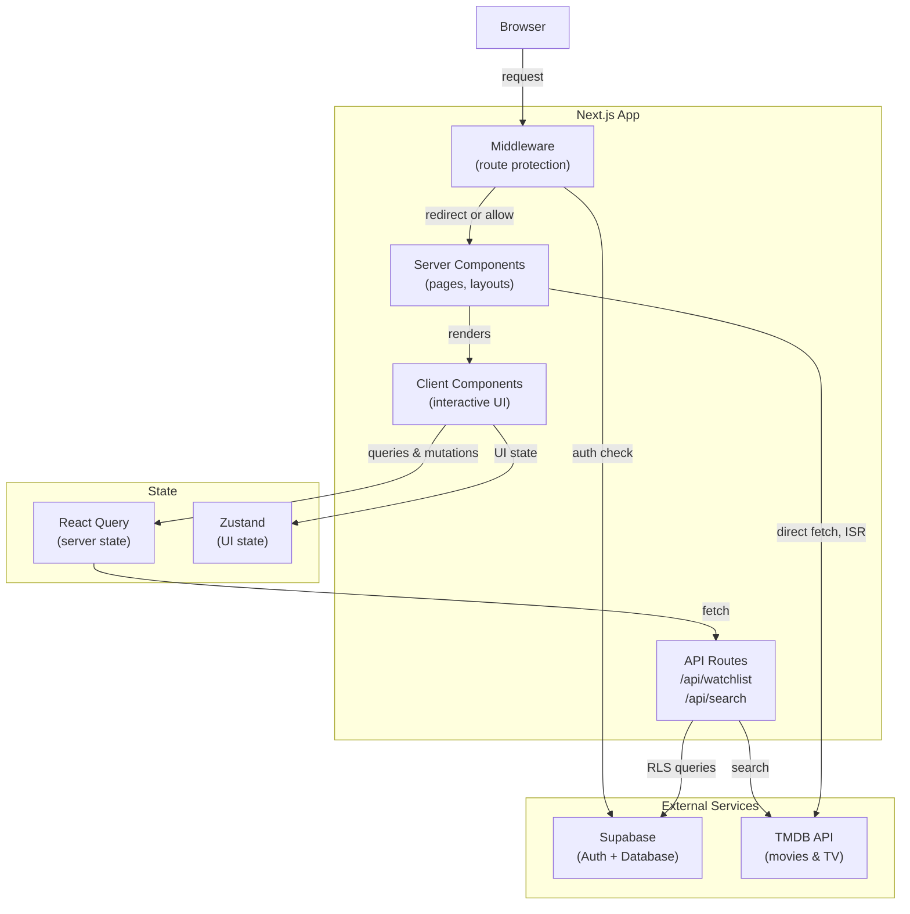

# Watchfolio

A personal movie and TV show tracker. Search for content via the TMDB API, manage a watchlist with status and ratings, and view stats on your viewing history through a dashboard.

---

## Tech Stack

| Layer              | Technology                                    |
| ------------------ | --------------------------------------------- |
| Framework          | [Next.js 16](https://nextjs.org) (App Router) |
| Language           | TypeScript 5 (strict mode)                    |
| Styling            | Tailwind CSS 4                                |
| UI Components      | Base UI + Shadcn                              |
| Charts             | Recharts                                      |
| Server State       | TanStack React Query 5                        |
| Client State       | Zustand 5                                     |
| Forms & Validation | React Hook Form + Zod                         |
| Auth & Database    | Supabase (SSR)                                |
| External Data      | TMDB API                                      |
| Testing            | Vitest + Testing Library                      |

---

## Architecture



### Key architectural decisions

- **Dual state management:** React Query handles all server-synced data (watchlist, search results) with caching and optimistic updates. Zustand manages transient UI state (dialogs, notifications) that doesn't need to persist.
- **Supabase SSR:** Sessions are managed server-side via `@supabase/ssr`. Middleware enforces auth on all `/dashboard`, `/search`, and `/watchlist` routes before the page renders — client-side guards alone are not relied upon.
- **API route layer:** Watchlist mutations go through Next.js API routes rather than calling Supabase directly from the client. This keeps RLS enforcement server-side and centralises input validation via Zod.
- **TMDB caching:** Server component fetches to TMDB use Next.js ISR (`revalidate: 3600`), so trending data is cached for an hour and doesn't hit the API on every request.

---

## Project Structure

```
app/
  (auth)/           # Login and signup pages
  (protected)/      # Authenticated pages: dashboard, search, watchlist
  api/              # API routes: /watchlist, /watchlist/[id], /search
components/
  auth/             # LoginForm, SignupForm, LogoutButton
  dashboard/        # Stats cards, charts, recent activity
  movies/           # MovieCard, MovieGrid
  shared/           # Navbar, ErrorBoundary, Notification, QueryProvider
  ui/               # Primitive UI components (Button, Card, Dialog, etc.)
hooks/              # useAuth, useSearch, useWatchlist
lib/
  supabase/         # Supabase client (browser, server, middleware)
  tmdb/             # TMDB API client and types
  validations/      # Zod schemas for auth, watchlist, env vars
store/              # Zustand UI store (dialogs, notifications)
tests/              # Unit tests mirroring the above structure
types/              # Shared TypeScript types
```

---

## Getting Started

### Prerequisites

- Node.js 18+
- A [Supabase](https://supabase.com) project
- A [TMDB API](https://developer.themoviedb.org) key

### 1. Clone and install

```bash
git clone https://github.com/acristinaa/watchfolio.git
cd watchfolio
npm install
```

### 2. Configure environment variables

```bash
cp .env.example .env.local
```

Fill in `.env.local`:

```env
NEXT_PUBLIC_SUPABASE_URL=        # From Supabase project settings → API
NEXT_PUBLIC_SUPABASE_ANON_KEY=   # From Supabase project settings → API
NEXT_PUBLIC_TMDB_API_KEY=        # From TMDB developer dashboard
TMDB_IMAGE_BASE=                 # Typically: https://image.tmdb.org/t/p
```

### 3. Set up the Supabase database

In your Supabase project, create the `watchlist` table:

```sql
create table watchlist (
  id uuid primary key default gen_random_uuid(),
  user_id uuid references auth.users(id) on delete cascade not null,
  media_id integer not null,
  media_type text check (media_type in ('movie', 'tv')) not null,
  title text not null,
  poster_path text,
  status text check (status in ('watchlist', 'watching', 'watched')) not null,
  rating integer check (rating between 1 and 10),
  review text,
  created_at timestamptz default now(),
  updated_at timestamptz default now(),
  unique (user_id, media_id, media_type)
);

-- Enable Row Level Security
alter table watchlist enable row level security;

create policy "Users can only access their own watchlist"
  on watchlist for all
  using (auth.uid() = user_id);
```

### 4. Run the development server

```bash
npm run dev
```

Open [http://localhost:3000](http://localhost:3000).

---

## Available Scripts

| Command                 | Description              |
| ----------------------- | ------------------------ |
| `npm run dev`           | Start development server |
| `npm run build`         | Build for production     |
| `npm run start`         | Start production server  |
| `npm run lint`          | Run ESLint               |
| `npm test`              | Run unit tests           |
| `npm run test:ui`       | Run tests with Vitest UI |
| `npm run test:coverage` | Generate coverage report |
